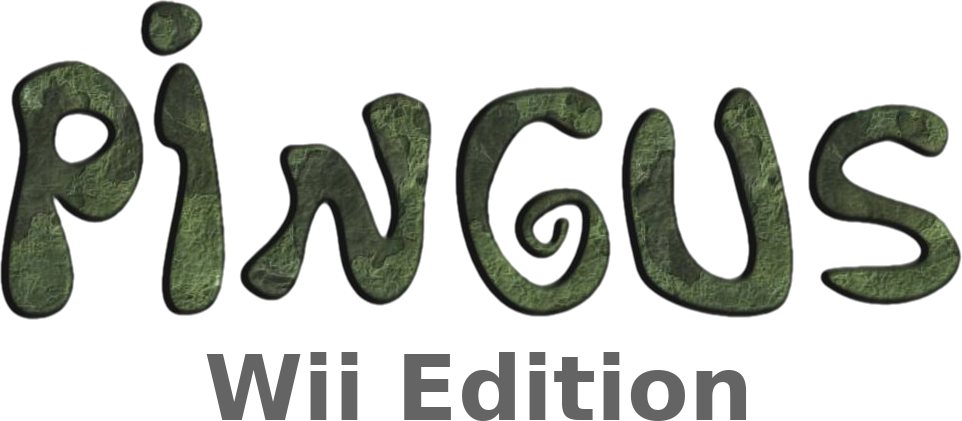

<p align="center">
  
</p>

<br><br>

## Wii port of the free open source puzzle-strategy game Pingus

```text
Original Port by: r-win
Updated by:       DeltaResero
Type:             Puzzle-Strategy
Version:          0.7.7-wii-d.01
Software license: GPLv3+
```

[![Latest Release][release-img]][release-url]
[![View All Releases][downloads-img]][downloads-url]
[](LICENSE)
[![Codacy Badge][codacy-img]][codacy-url]

<!-- Link Definitions -->
[release-img]: https://img.shields.io/github/v/release/DeltaResero/pingus-wii?label=Latest%20Release
[release-url]: https://github.com/DeltaResero/pingus-wii/releases/latest
[downloads-img]: https://img.shields.io/badge/Downloads-View_All_Releases-blue
[downloads-url]: https://github.com/DeltaResero/pingus-wii/releases
[codacy-img]: https://app.codacy.com/project/badge/Grade/c5cfbc54d8d44c888338cbb993230895
[codacy-url]: https://app.codacy.com/gh/DeltaResero/pingus-wii/dashboard

<br>

## About This Repository

This is a continuation fork of the original Wii port by r-win that was based on the stable 0.7.6 release
of Pingus and is archived at the [Google Code archive](https://code.google.com/archive/p/r-win-pingus-wii/).
This port is designed for use through the [Homebrew Channel](http://wiibrew.org/wiki/Homebrew_Channel).

This repository updates the port to be based on the upstream slightly newer release branch
[0.7.7](https://github.com/Pingus/pingus/tree/release-0.7.7). When cross compiling for Wii,
it relies on [SDL 1.2 for Wii](https://github.com/devkitPro/SDL/tree/ogc-sdl-1.2) and uses
[OpenGL (via OpenGX)](https://github.com/devkitPro/opengx) for hardware-accelerated graphics.
The [original Pingus](https://github.com/Pingus/pingus) repository is hosted on
[GitHub](https://github.com/). For more information about the game, please visit the official
website at [pingus.seul.org](https://pingus.seul.org/).

<br>

## About Pingus

Pingus is a free and open source puzzle-strategy game where you are tasked with guiding a
horde of penguins safely through hazardous, trap-filled levels. As the penguins walk on
their own, you must assign them special abilities like digging, building, and blocking to
help them reach the exit.

It includes a few ideas of its own such as the **Worldmap** and **Secret Levels** and it
also introduces new command actions such as the **Jumper**, which were not present in the
classic games that inspired it.

<br>

## Gameplay Mechanics

### Pingu Actions

To navigate the level, the player assigns specific actions to the Pingus. Some actions are
permanent, while others are temporary or one-time uses.

<table>
  <tr>
    <td align="center"></td>
    <td><strong>Basher:</strong> Digs a horizontal tunnel until they hit steel or run out
    of ground.</td>
  </tr>
  <tr>
    <td align="center"></td>
    <td><strong>Blocker:</strong> Stands still and reverses the direction of any other
    Pingu that touches them.</td>
  </tr>
  <tr>
    <td align="center"></td>
    <td><strong>Bomber:</strong> Explodes after a 5-second countdown, destroying the Pingu
    and surrounding terrain.</td>
  </tr>
  <tr>
    <td align="center"></td>
    <td><strong>Bridger:</strong> Builds a staircase at a 30-degree angle until they hit a
    ceiling or run out of bricks.</td>
  </tr>
  <tr>
    <td align="center"></td>
    <td><strong>Climber:</strong> Permanently allows a Pingu to scale vertical walls
    instead of turning around.</td>
  </tr>
  <tr>
    <td align="center"></td>
    <td><strong>Digger:</strong> Digs a vertical shaft straight down until they hit steel
    or fall into empty space.</td>
  </tr>
  <tr>
    <td align="center"></td>
    <td><strong>Floater:</strong> Deploys a propeller to glide gently down from heights,
    preventing death from falling.</td>
  </tr>
  <tr>
    <td align="center"></td>
    <td><strong>Jumper:</strong> Performs a high leap forward to clear small gaps or
    obstacles.</td>
  </tr>
  <tr>
    <td align="center"></td>
    <td><strong>Miner:</strong> Digs a diagonal tunnel downwards through the terrain.</td>
  </tr>
</table>

### Pingu Behavior

Pingus are autonomous; they will walk forward until they hit an obstacle or are given a
command.

<table>
  <tr>
    <td align="center"></td>
    <td><strong>Walls:</strong> Pingus reverse direction at walls or borders higher than
    they can step (approx. 3 pixels).</td>
  </tr>
  <tr>
    <td align="center"></td>
    <td><strong>Slopes:</strong> Pingus can walk up slopes and over diagonal terrain.</td>
  </tr>
  <tr>
    <td align="center"></td>
    <td><strong>Falling:</strong> Pingus fall when walking off a ledge. High falls are
    fatal without a Floater.</td>
  </tr>
</table>

<br>

## Setup Guide for devkitPro PowerPC Build System

To set up the devkitPro devkitPPC PowerPC build system, follow the instructions on the
official devkitPro wiki:

- [Getting Started with devkitPro](https://devkitpro.org/wiki/Getting_Started)
- [devkitPro Pacman](https://devkitpro.org/wiki/devkitPro_pacman)

After setting up devkitPPC including environment variables, use `(dkp-)pacman` to install
the following dependencies:

**Build Tools (Required):**
```
devkitPPC (C++20 compatible cross compiler)
wii-cmake
wii-pkg-config
```

**Core Libraries (Required):**
```
libogc
libfat-ogc
wii-sdl
wii-sdl_image
wii-sdl_mixer
```

**Graphics & Compression:**
```
ppc-libpng
ppc-freetype
ppc-zlib
```

**OpenGL/OpenGX Backend:**
```
wii-freeglut
wii-glu
wii-opengx
```

<br>

## Build Configuration

You can configure the build by passing flags to `cmake`. For example, to enable the
level editor, append the following flag to your `cmake` command: `-DWITH_EDITOR=ON`

| Option             | Description                                 | Default   |
|------------------  |---------------------------------------------|-----------|
| `CMAKE_BUILD_TYPE` | Build type (Debug or Release)               | `Release` |
| `WITH_EDITOR`      | Build with the level editor                 | `OFF`     |
| `WITH_OPENGL`      | Build with OpenGL support                   | `ON`      |
| `ENABLE_LOGGING`   | Enable application logging                  | `OFF`     |
| `WARNINGS`         | Set Extra compiler warnings (-Wall -Wextra) | `ON`      |
| `WERROR`           | Treat compiler warnings as errors (-Werror) | `OFF`     |
| `BUILD_TESTS`      | Build test programs                         | `OFF`     |

<br>

## How to Build: Wii Homebrew Build

1. Create a build directory:
   ```bash
   mkdir build
   cd build
   ```

2. Configure using CMake and the included Wii Toolchain file:
   ```bash
   cmake -DCMAKE_TOOLCHAIN_FILE=../cmake/toolchains/Wii.cmake ..
   ```
   Alternatively, the system-wide toolchain provided by devkitPro should work:
   ```bash
   cmake -DCMAKE_TOOLCHAIN_FILE=$DEVKITPRO/cmake/Wii.cmake ..
   ```

3. Build the game:
   ```bash
   make -j$(nproc)
   ```

   This will generate `pingus.dol` and a ready-to-deploy folder structure in
   `build/apps/pingus`.

<br>

## Installing Pingus on Wii (Homebrew Channel)

1. The build process automatically creates the necessary folder structure in
   `build/apps/pingus`.

2. Copy the `pingus` folder from `build/apps/` to the `apps/` folder on your SD/USB
   device.
   ```
   SD:/apps/pingus/pingus.dol
   SD:/apps/pingus/data/
   SD:/apps/pingus/icon.png
   SD:/apps/pingus/meta.xml
   ```

3. Launch Pingus from the Homebrew Channel.

<br>

## How to Build: Desktop Linux (Testing/Unsupported)

1. Install Dependencies:
   You will need the following build tools and libraries. Ensure you install the
   **development headers** (often ending in `-dev` or `-devel`).

   **Build Tools:**
   ```
   C++20 Compiler (GCC 10+ or Clang 10+)
   CMake 3.10 or later
   ```

   **Required Libraries:**
   ```
   SDL 1.2
   SDL_image
   SDL_mixer
   libpng
   zlib
   ```

   **Optional Libraries:**
   ```
   OpenGL
   ```

2. Create a build directory and configure:
   ```bash
   mkdir build_linux
   cd build_linux
   cmake ..
   ```

3. Build:
   ```bash
   make -j$(nproc)
   ```

**Important Note on Installation:**
While `sudo make install` is supported by CMake, it is **not recommended** for this
project. Installing files directly to your system directories this way without using a
package manager makes them very difficult to uninstall cleanly later. We strongly recommend
using the portable method for testing.

**Note on Other Operating Systems:**
Support for other platforms (Windows, macOS, BSD) is currently outside the scope of this
repository, as the primary focus is the Wii hardware. Given the standard CMake
infrastructure, adapting the build system for other platforms should be fairly trivial.

<br>

## Rendering Backends

Pingus supports multiple rendering backends which can be selected at runtime using the
`-r` or `--renderer` command line flags or via the options menu.

- **sdl:** A simple software renderer based on SDL. This is the default and safest option
  for compatibility.
- **opengl:** Uses hardware acceleration to render graphics. It is much faster than the
  SDL renderer and is recommended if your hardware supports OpenGL.
- **delta:** Uses SDL but attempts to optimize performance by only re-rendering screen
  elements that have changed. Some effects (like scrolling backgrounds) are disabled in
  this mode to maximize performance.

## Bug Reporting

This is a fork of the original Pingus project. **Please do not report bugs for this version
to the original Pingus developers.** This version deviates from the original codebase and
follows a different development philosophy. Please report any bugs, crashes, or issues
found in this fork via the **Issues** tab on this GitHub repository page.

## Acknowledgments

This software is a fork of the original Pingus project created by Ingo Ruhnke. For a
detailed history and a full list of attributions, please see the [AUTHORS](AUTHORS) file.

## License

This program is distributed under the terms of the GNU General Public License version 3
(or later). You can redistribute it and/or modify it under the terms of the GNU General
Public License as published by the Free Software Foundation, either version 3 of the
License, or (at your option) any later version.

Please see the [LICENSE](LICENSE) file for the full text.

## Disclaimer

This is an unofficial port of Pingus that runs on the Wii via the Homebrew
Channel. It is not affiliated with, endorsed by, nor sponsored by the
creators of the Wii console nor the Homebrew Channel. All trademarks and
copyrights are the property of their respective owners.

This project is distributed in the hope that it will be useful, but
**WITHOUT ANY WARRANTY**; without even the implied warranty of
**MERCHANTABILITY** or **FITNESS FOR A PARTICULAR PURPOSE**. See the
[GNU General Public License](https://www.gnu.org/licenses/gpl-3.0.en.html)
for more details.
